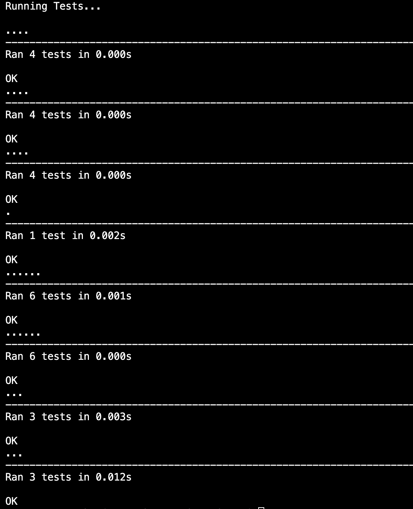

# Python Weather Project

Everyday we collect data about the weather in order to predict the forecast for the coming days. The problem is that this data is never in a human readable format. This project uses python code to process csv files containing data about the weather, and converts them into meaningful text-based summaries. The csv and datetime modules have been used to assist with this task. 

## Functions

- Convert ISO formatted date into a human readable format
- Convert a temperature from Farenheit to Celcius
- Calculate the mean value from a list of numbers
- Read a csv file and store the data in a list
- Calculate the minimum and maximum value in a list of numbers
- Output a summary for the given weather data
- Output a daily summary for the given weather data

## Testing

Several tests have been completed to ensure the correct outputs for a variety of different inputs.

